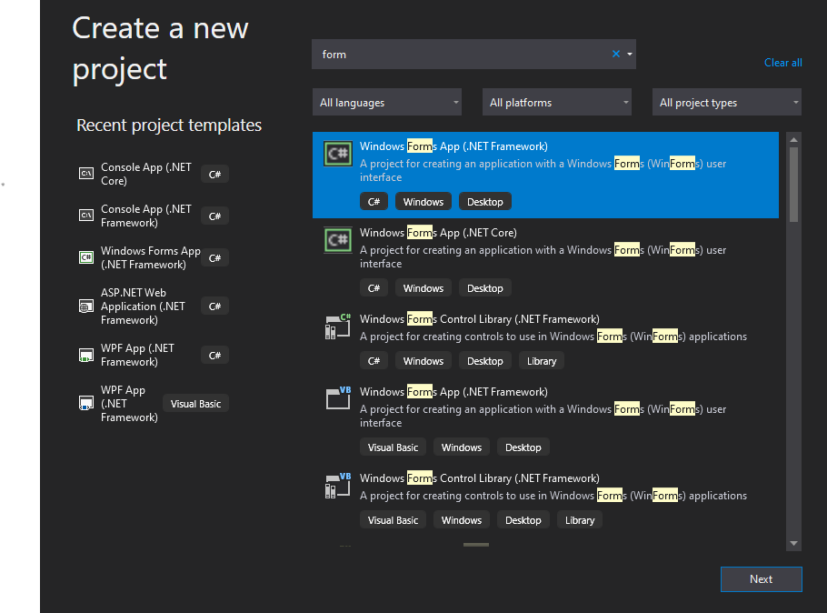
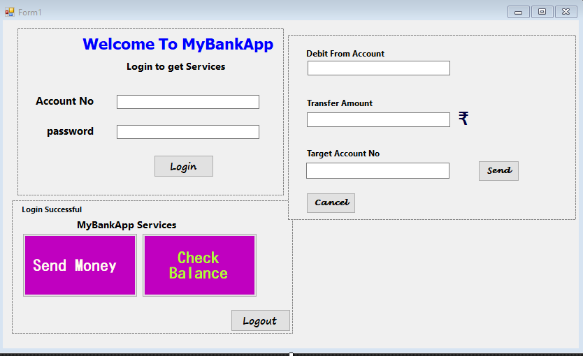
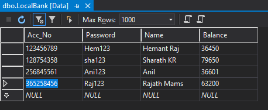
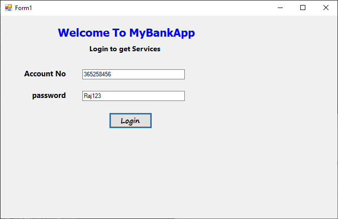
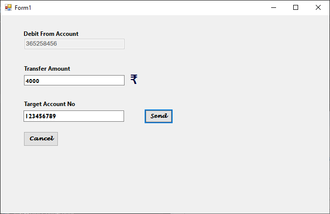
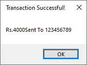
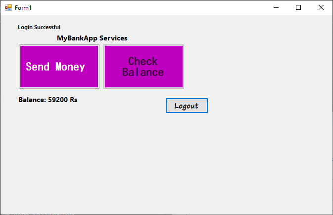
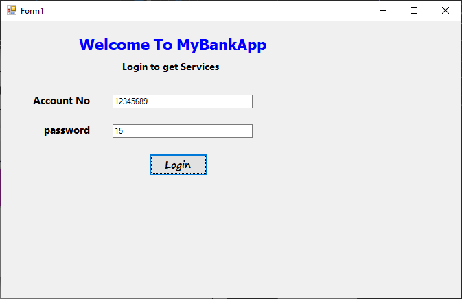
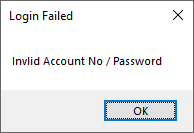

# SimpleBank Transaction App

A Simple Bank Transaction App using **C#.Net** Form Based Desktop Application with MS-SQL Server DataBase
---
### Requirements
- **Visual Studio IDE**
- **C#.NET**
- **MS-SQL Server DB**
---
### How to Build Simple Bank Transaction App?
---
***step 1 :***  Setup Visual Studio IDE with C#.NET Environment
---
***step 2 :***  Open Visual Studio & Create a New Form Based Application
---

---
***step 3 :***  Design Application Form Window (User Interface)
---

---
**step 4 :**  Create a Database [Table] in inbuilt MS-SQL Server Database (LocalBank)
            - Insert Data to all Columns           
---

---
***step 5 :*** Copy the Connection String to Your Code [Form1.cs]
---
```C#
        #Your Connection String Will be Different
        static string con_str = "Data Source=(LocalDB)\\MSSQLLocalDB;AttachDbFilename=C:\\Users\\Sanjay-PC\\source\\repos\\Sanjay_C#_Lab\\Bank Transaction\\Bank Transaction\\LocalBankDB.mdf;Integrated Security=True";
        SqlConnection conn=new SqlConnection(con_str);
        SqlCommand cmd;
```
---
***step 6:*** c#[Backend] Code
---
```c#
using System;
using System.Data.SqlClient;
using System.Windows.Forms;


namespace Bank_Transaction
{
    public partial class Form1 : Form
    {
        static string con_str = "Data Source=(LocalDB)\\MSSQLLocalDB;AttachDbFilename=C:\\Users\\Sanjay-PC\\source\\repos\\Sanjay_C#_Lab\\Bank Transaction\\Bank Transaction\\LocalBankDB.mdf;Integrated Security=True";
        SqlConnection conn=new SqlConnection(con_str);
        SqlCommand cmd;
        string sql, login_acc_no="";
        float Bal = 0;
        
        public Form1()
        {
            InitializeComponent();
            Home_Panel.Visible = false;
            Transaction_Panel.Visible = false;
            conn.Open();
        }
  
        private void Login_Btn_Click(object sender, EventArgs e)
        {
            SqlDataReader dreader1;
            if (acc_no.Text != "" && pswd.Text != "")
            {
                sql = "Select * from dbo.LocalBank where (Acc_No=" + acc_no.Text + " AND Password=\'" + pswd.Text + "\')";
                cmd = new SqlCommand(sql, conn);
                using (dreader1 = cmd.ExecuteReader())
                {
                    if (dreader1.Read())
                    {
                        Home_Panel.Location = Login_Panel.Location;
                        Login_Panel.Visible = false;
                        Home_Panel.Visible = true;

                        login_acc_no = acc_no.Text;
                        dreader1.Close();
                    }
                    else
                        MessageBox.Show("Invlid Account No / Password", "Login Failed");
                }
            }
            else
                MessageBox.Show("Please Enter Account No* and Password*", "Login Failed");
            Bal_Btn.Enabled = true;
        }

        private void Bal_Btn_Click(object sender, EventArgs e)
        {
            SqlDataReader dreader2;
            sql = "select Balance from dbo.LocalBank where Acc_No=" + acc_no.Text;
            cmd = new SqlCommand(sql, conn);            
            dreader2 = cmd.ExecuteReader();
            if (dreader2.Read())
                Bal_lb.Text = "Balance: " + dreader2.GetValue(0)+" Rs";                
            dreader2.Close();    
            Bal_Btn.Enabled = false;
        }
        private void logout_Btn_Click(object sender, EventArgs e)
        {
            conn.Dispose();
            conn.Close();
            Application.Restart();
        }
        private void send_Btn_Click(object sender, EventArgs e)
        {
            deb_acc_no.Text = login_acc_no;
            deb_acc_no.Enabled = false;
            Bal_lb.Text = "";
            Transaction_Panel.Location = Login_Panel.Location;
            Home_Panel.Visible = false;
            Transaction_Panel.Visible =true ;
        }       

        private void send_cnf_Btn_Click(object sender, EventArgs e)
        {
            SqlDataReader dreader3;
            SqlDataReader readBal;
            sql = "select Balance from dbo.LocalBank where Acc_No=" + deb_acc_no.Text;
            cmd = new SqlCommand(sql, conn);
            readBal = cmd.ExecuteReader();
            if(readBal.Read())
            {
                Bal=(float)readBal.GetDouble(0);
                readBal.Close();
            }

            SqlTransaction trans = conn.BeginTransaction();            
            //Existance of Target Acct
            sql = "select * from dbo.LocalBank where Acc_No=" + Target_Account_No.Text;
            cmd = new SqlCommand(sql, conn,trans);
            dreader3 = cmd.ExecuteReader();
            if (dreader3.Read())//if exists
            {
                if (Transfer_Amount.Text != "")
                {
                    float Transfer_amt = float.Parse(Transfer_Amount.Text);
                    if (Transfer_amt > 0 && Transfer_amt < Bal)
                    {
                        //Update
                        sql = @"Update dbo.LocalBank SET Balance=Balance-" + Transfer_amt + " where Acc_No=" + deb_acc_no.Text + ";" +
                           "Update dbo.LocalBank SET Balance = Balance+" + Transfer_amt + " where Acc_No = " + Target_Account_No.Text + ";";
                        cmd = new SqlCommand(sql, conn);
                        dreader3.Close();
                        cmd.Transaction = trans;
                        int ret = cmd.ExecuteNonQuery();
                        Console.WriteLine(ret);
                        trans.Commit();
                        MessageBox.Show("Rs." + Transfer_amt + "Sent To " + Target_Account_No.Text, " Transaction Successful!");
                        Transaction_Panel.Visible = false;
                        Home_Panel.Visible = true;
                    }
                    else
                        MessageBox.Show("No Sufficient Balance or Invalid Amount", "Alert!");
                }
                else
                    MessageBox.Show("Enter valid Amount", "Alert!");
            }
            else
                MessageBox.Show("Target Account Not Exist", "Transaction Failed!");            
            Bal_Btn.Enabled = true;
        }

        private void cancel_Btn_Click(object sender, EventArgs e)
        {
            Transaction_Panel.Visible = false;
            Home_Panel.Visible = true;
        }

        private void Form1_KeyDown(object sender,KeyEventArgs ke)
        {
            if(ke.Alt && ke.KeyCode==Keys.F4)
            {
                conn.Dispose();
                conn.Close();
            }
        }
    }
}
```
---
## Running Application [ F5 ]
---
**Login Page**
---

---
**Checking Balance in Transaction Window [Check Balance Button]**
---

---
**Transaction after Clicking [Send Money Button]**
---


**Transaction Message**


---
**Checking Balance After Transaction**
---

---
**Invalid Login Attempt**
---


---
**MS-SQL DataBase After Transactions**
---

---


